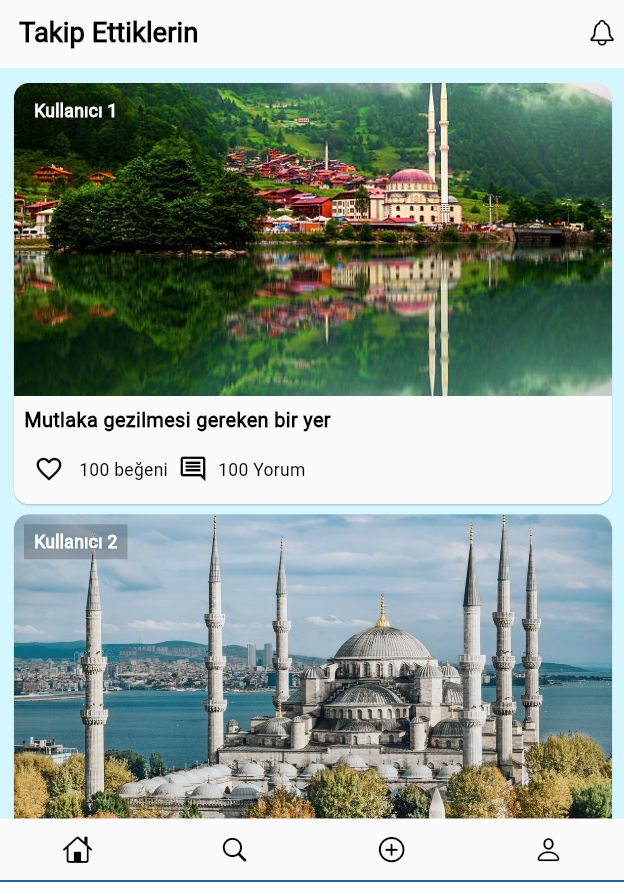
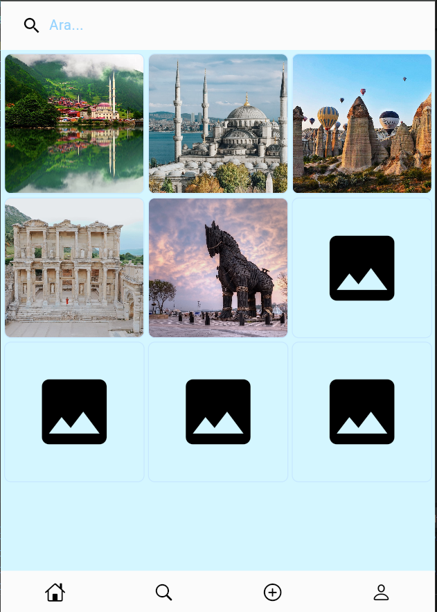
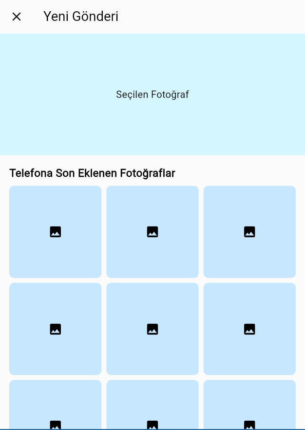
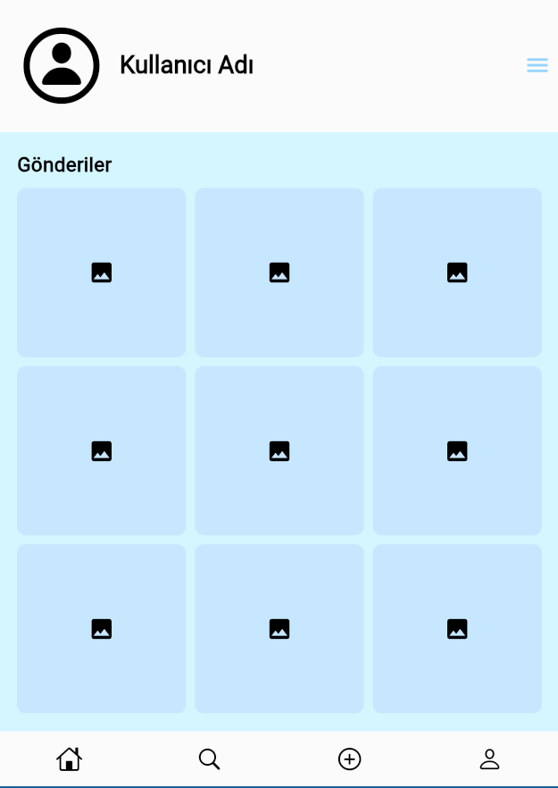

# Flutter Projesi


## Proje Hakkında

Kullanıcıların gezmek istedikleri şehirlerdeki en iyi mekanları bulmalarını, kullanıcıların, başkalarının da keşfetmesini istedikleri yerleri ekleyebildiği bir uygulama.


  

## Ekibimiz

-  **Danışman:**  
- [Keyvan Arasteh](https://github.com/keyvanarasteh)


-  **Takım Üyeleri:**

- [Oğuzhan Berk Cin](https://github.com/OguzhanCin)

  

## Özellikler

- [Kullanıcıların takip ettiği kişilerin payalşımlarını bulunduran HomeScreen]

- [Kullanıcının keşfettmek istediği yerleri araması için SearchScreen]

- [Kullanıcıların post ekleyebildiği AddScreen]

- [Kullanıcıların kendi profillerini düzenlediği ProfileScreen]
  

## Kullanılan Teknolojiler

- Flutter

- Dart

- Lottie


## Başlangıç

  

### Gereksinimler

- Flutter SDK (sürüm X.X.X)

- Dart SDK (sürüm X.X.X)

  
### Kurulum Adımları

1. Projeyi bilgisayarınıza indirin:

```bash

git  clone [https://github.com/OguzhanCin/TravelBuddy]

```

  

2. Proje klasörüne gidin:

```bash

cd [TravelBuddy]

```

  

3. Gerekli paketleri yükleyin:

```bash

flutter  pub  get

```

  

4. Uygulamayı başlatın:

```bash

flutter  run

```

  

## Proje Yapısı

```

lib/

├── modeller/ # Veri modelleri

├── ekranlar/ # Uygulama ekranları

├── widgets/ # Tekrar kullanılabilir arayüz öğeleri

├── servisler/ # API servisleri

└── yardımcılar/ # Yardımcı fonksiyonlar

```

  

## Ekran Görüntüleri






## Demo Video

  https://github.com/user-attachments/assets/cc39409f-3452-4419-a04c-a133b369dde7

## Projeye Katkı Sağlama

1. Projeyi forklayın

2. Yeni bir dal oluşturun (`git checkout -b ozellik/YeniOzellik`)

3. Değişikliklerinizi kaydedin (`git commit -m 'Yeni özellik eklendi'`)

4. Dalınıza gönderin (`git push origin ozellik/YeniOzellik`)

5. Pull Request oluşturun

  

## Lisans

[Lisans türü] kapsamında lisanslanmıştır. Daha fazla bilgi için `LICENSE` dosyasını inceleyebilirsiniz.

  

## İletişim

- Proje Bağlantısı: [https://github.com/OguzhanCin/TravelBuddy]

- İstinye Üniversitesi: [https://www.istinye.edu.tr/](https://www.istinye.edu.tr/)

  

## Teşekkürler

- İstinye Üniversitesi'ne destekleri için teşekkür ederiz


  
  